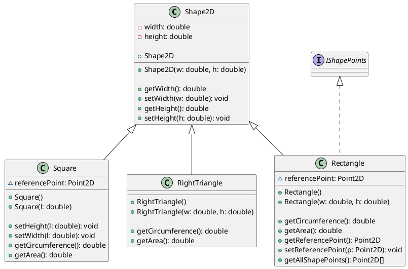
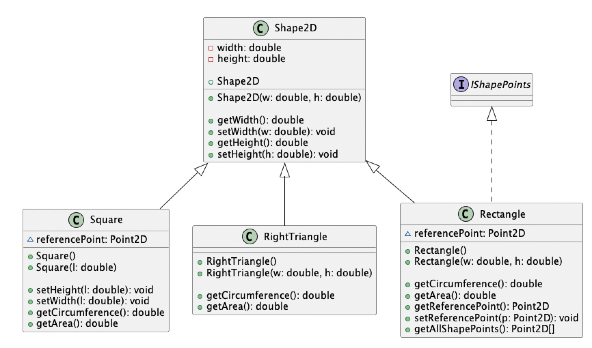
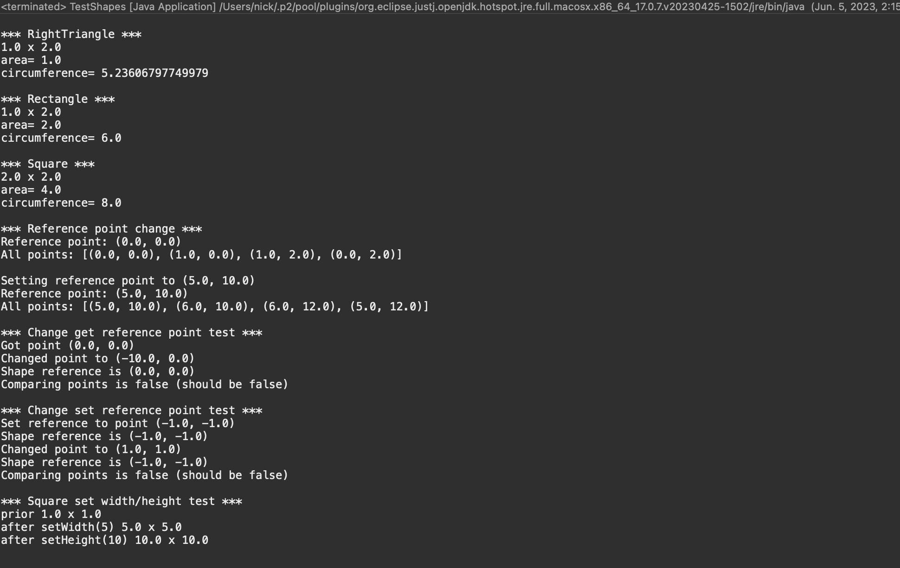

# Shapes report
Author: Nick Nikolov

## UML class diagram

This screenshot showws the PlantUML diagram

## Execution and Testing

This screenshot shows successful execution of the TestShapes program

