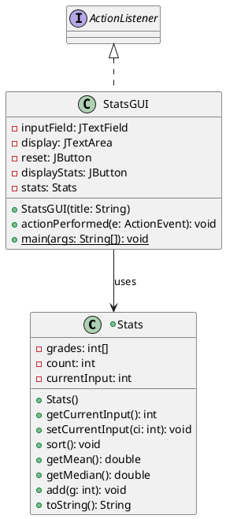
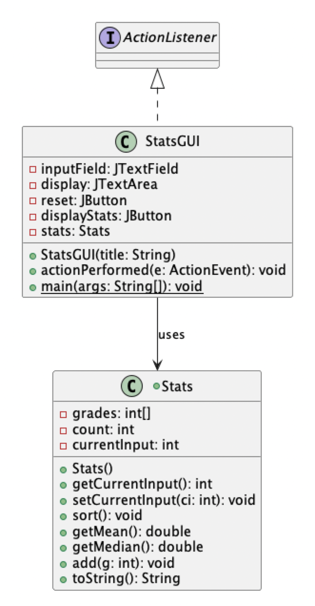
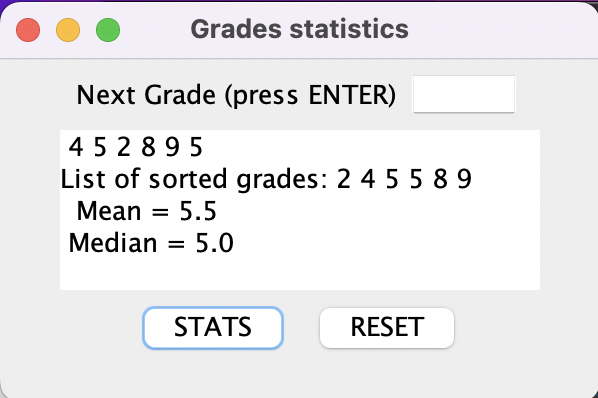
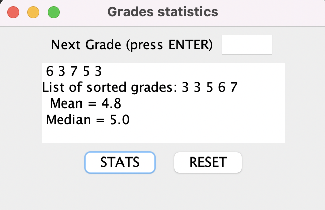

# Stats report
Author: Nick Nikolov

## UML class diagram

This screenshot shows the PlantUML diagram for the Stats and StatsGUI classes

## Execution and Testing
This screenshot shows successful execution of the Stats program using an even number of inputs

This screenshot shows successful execution of the Stats program using an odd number of inputs

# Reflection

Stats - I liked getting more familiar with getting user inputs and performing an action based on inputs and buttons clicked. e.getSource was a mystery to me before this assignment. Feels like magic.

shapes - circumference is not used for non-circular shapes. The correct word should be perimeter.
